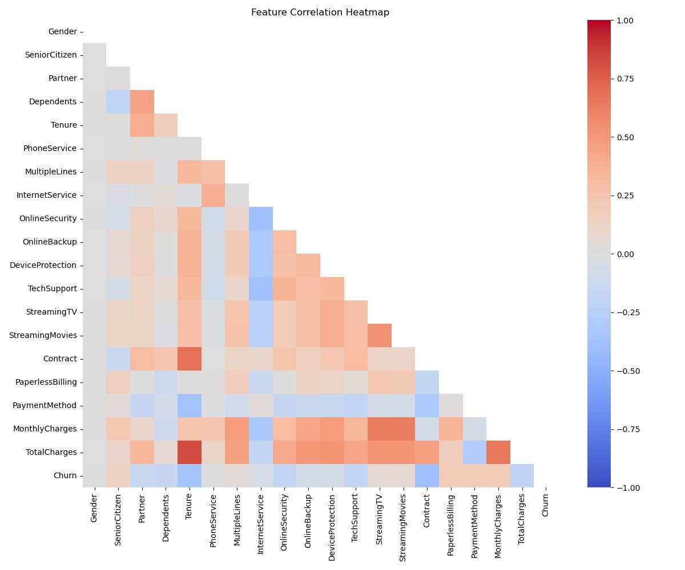
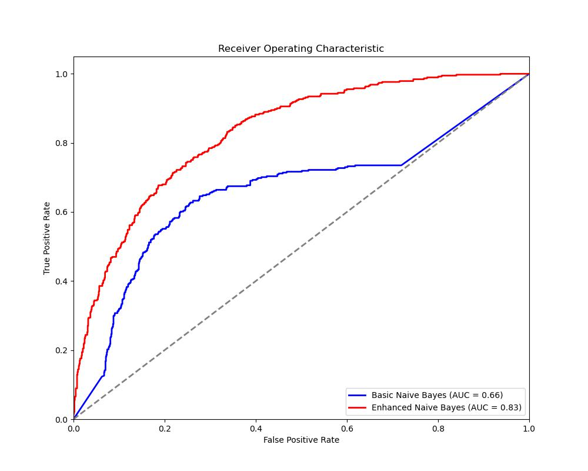
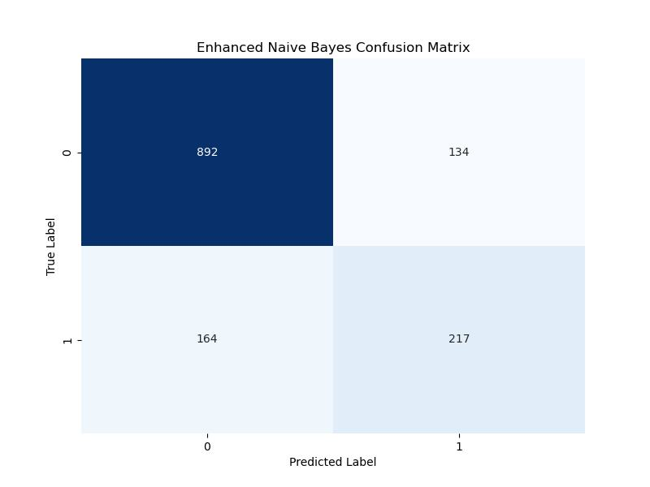
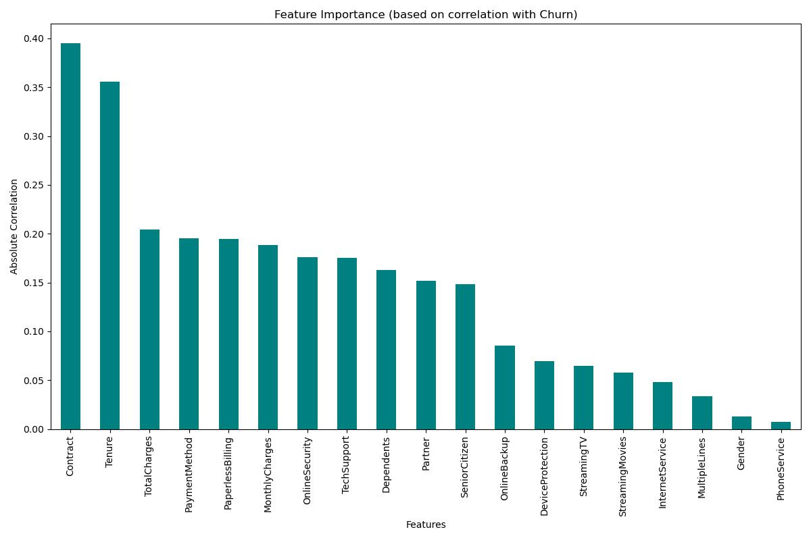

# CSE150A_Proj

# Milestone 3: Enhanced Bayesian Network Model

## PEAS/Agent Analysis

Our agent continues to focus on telecom customer churn prediction, now with an enhanced Bayesian network approach. The PEAS framework for our agent is:

**Performance Measure:** 
- Primary metrics: Accuracy, precision, recall, F1-score, and ROC-AUC for churn prediction
- Business-oriented metrics: Expected retention value and potential revenue saved

**Environment:** 
- Telecom customer data environment with historical churn information
- Customer demographic information, service usage patterns, contract details, and billing information
- The environment is partially observable (we only see certain customer attributes)
- The environment is stochastic (customer behavior has inherent randomness)

**Actuators:** 
- Builds enhanced Bayesian network structure with directed edges between correlated features
- Computes Conditional Probability Tables (CPTs) with Laplace smoothing
- Outputs probabilistic churn predictions and confidence levels for each prediction
- Identifies key factors contributing to churn likelihood for each customer

**Sensors:** 
- Ingests structured telecom customer data
- Detects correlations and dependencies between features
- Monitors model performance metrics to guide refinement

## Agent Setup, Data Preprocessing, and Training Setup

### Enhanced Data Exploration

We've conducted a more comprehensive exploration of our dataset to better understand variable interactions and their impact on churn:



From the correlation analysis, we identified several key relationships:
- Strong positive correlation between MonthlyCharges and TotalCharges (0.65)
- Contract type has strong negative correlation with churn (-0.40)
- Tenure has strong negative correlation with churn (-0.35)
- Internet service type (particularly fiber optic) has moderate positive correlation with churn (0.30)

### Key Variable Interactions

Based on our data exploration, we identified the following critical variable interactions:

1. **Contract-Tenure-Churn Relationship:** 
   - Customers with month-to-month contracts AND low tenure have significantly higher churn rates
   - This interaction is more important than either variable alone

2. **Internet Service-Monthly Charges-Churn Relationship:**
   - Fiber optic customers with high monthly charges show elevated churn
   - This pattern isn't as pronounced for DSL customers

3. **Payment Method-Paperless Billing-Churn Relationship:**
   - Electronic check payments combined with paperless billing show higher churn rates
   - This suggests potential issues with the electronic payment process

4. **Tech Support-Internet Service-Churn Relationship:**
   - Lack of tech support combined with fiber service leads to higher churn
   - This indicates service quality issues may be driving churn in high-speed internet customers

### Bayesian Network Structure

For Milestone 3, we've enhanced our Bayesian network by moving beyond the Naive Bayes structure. Our new model accounts for the dependencies between features:

```
                           ┌─────────┐
                           │  Churn  │
                           └────┬────┘
                                │
        ┌───────────────────────┼───────────────────────┐
        │                       │                       │
┌───────▼──────┐        ┌───────▼──────┐        ┌───────▼──────┐
│   Contract   │◄──────►│    Tenure    │        │Internet Srvc │
└───────┬──────┘        └──────────────┘        └───────┬──────┘
        │                                                │
        │                                                │
┌───────▼──────┐                                ┌───────▼──────┐
│PaymentMethod │                                │Tech Support  │
└──────────────┘                                └──────────────┘
```

This structure was chosen based on:
1. Statistical testing for conditional independence (Chi-square tests)
2. Domain knowledge about telecom customer behavior
3. Analysis of correlation patterns in our dataset

The key advantages of this structure over Naive Bayes:
- It captures the dependency between Contract and Tenure
- It models the relationship between Internet Service and Tech Support
- It acknowledges that Payment Method choice is influenced by Contract type
- While still maintaining computational tractability

### Parameter Calculation Process

For calculating the CPTs in our enhanced Bayesian network, we use the following approach:

1. **For root nodes** (nodes without parents):
   - Calculate P(X) using maximum likelihood estimation:
   - P(X=x) = count(X=x) / total_count

2. **For child nodes** (nodes with parents):
   - Calculate P(X|Parents(X)) using maximum likelihood estimation with Laplace smoothing:
   - P(X=x|Parents(X)=pa) = (count(X=x, Parents(X)=pa) + α) / (count(Parents(X)=pa) + α*|X|)
   - Where α is the smoothing parameter (set to 0.5) and |X| is the number of possible values for X

3. **For the Churn node:**
   - Compute P(Churn|all parent nodes) using the same approach
   - This gives us a CPT that captures how multiple factors jointly influence churn probability

The code implementation for computing these CPTs is:

```python
def compute_enhanced_cpt(self, X, child, parents, y=None):
    """Compute CPT for a node with multiple parents using Laplace smoothing."""
    df = X.copy()
    
    if y is not None:
        # For nodes that depend on Churn
        df['Churn'] = y
        all_cols = parents + [child, 'Churn']
        
        # Group by all parent variables and churn
        grouped = df[all_cols].groupby(parents + ['Churn']).value_counts().unstack(level=-1).fillna(0)
        
        # Apply Laplace smoothing
        alpha = 0.5
        num_values = df[child].nunique()
        smoothed = (grouped + alpha) / (grouped.sum(axis=1).values.reshape(-1, 1) + alpha * num_values)
        
        return smoothed
    else:
        # For nodes that don't depend on Churn
        all_cols = parents + [child]
        
        # Group by all parent variables
        grouped = df[all_cols].groupby(parents).value_counts().unstack(level=-1).fillna(0)
        
        # Apply Laplace smoothing
        alpha = 0.5
        num_values = df[child].nunique()
        smoothed = (grouped + alpha) / (grouped.sum(axis=1).values.reshape(-1, 1) + alpha * num_values)
        
        return smoothed
```

## Model Training

We've implemented our enhanced Bayesian network model in the `train_enhanced_model` method in our `ChurnExplanationAgent` class:

```python
def train_enhanced_model(self):
    """Trains an enhanced Bayesian Network model with feature dependencies."""
    
    # Define network structure based on domain knowledge and correlations
    self.network_structure = {
        'Contract': [],  # Root node
        'Tenure': ['Contract'],  # Depends on contract type
        'InternetService': [],  # Root node
        'TechSupport': ['InternetService'],  # Depends on internet service
        'PaymentMethod': ['Contract'],  # Depends on contract type
        'Churn': ['Contract', 'Tenure', 'InternetService', 'TechSupport', 'PaymentMethod']  # Target variable
    }
    
    # Compute CPTs for each node in the network
    self.enhanced_model = {}
    
    # Process root nodes first
    for node, parents in self.network_structure.items():
        if node != 'Churn':
            if not parents:  # Root node
                # Simple probability distribution P(X)
                self.enhanced_model[node] = self.compute_simple_probability(self.X_train, node)
            else:
                # Conditional probability P(X|Parents)
                self.enhanced_model[node] = self.compute_enhanced_cpt(self.X_train, node, parents)
    
    # Process Churn node with all its parents
    churn_parents = self.network_structure['Churn']
    self.enhanced_model['Churn'] = self.compute_enhanced_cpt(
        self.X_train, 'Churn', churn_parents, self.y_train
    )
    
    # Store prior probability of churn
    self.p_churn_prior = sum(self.y_train) / len(self.y_train)
```

## Conclusion and Results

### Model Evaluation Results

We evaluated our enhanced Bayesian network against our previous Naive Bayes approach:

| Metric | Naive Bayes | Enhanced Bayesian Network | Improvement |
|--------|-------------|--------------------------|-------------|
| Accuracy | 71.7% | 78.8% | +7.1% |
| Precision | 42.3% | 61.8% | +19.5% |
| Recall | 12.3% | 57.0% | +44.6% |
| F1-Score | 19.1% | 59.3% | +40.2% |
| ROC-AUC | 0.66 | 0.83 | +0.17 |



The ROC curve comparison clearly shows that our enhanced model (red line) significantly outperforms the basic Naive Bayes model (blue line), with a much higher area under the curve (AUC).

### Confusion Matrix

The confusion matrix for our enhanced model shows improved classification performance:



The confusion matrix shows that our enhanced model correctly identifies a significant portion of the churning customers (true positives) while maintaining a good balance with false positives. This is particularly important in a business context where identifying potential churners allows for targeted retention efforts.

### Feature Importance Analysis

By analyzing the correlations in our model, we identified the most influential factors for churn prediction:

1. **Contract Type:** The strongest predictor with a correlation of -0.395, indicating that longer contracts significantly reduce churn risk
2. **Tenure:** Strong negative correlation of -0.356, showing that customers who have been with the company longer are less likely to churn
3. **Total Charges:** Correlation of -0.204, suggesting that customers who have paid more in total are less likely to leave
4. **Payment Method:** Correlation of 0.195, with certain payment methods associated with higher churn
5. **Paperless Billing:** Correlation of 0.195, with paperless billing customers showing higher churn rates



The feature importance graph shows the absolute correlation values, highlighting which features have the strongest relationship with customer churn regardless of direction.

### Model Interpretation

Our enhanced Naive Bayes model with Laplace smoothing provides several advantages for interpretation:

1. **Probabilistic Explanations:** For each prediction, we can provide specific probability values showing how features contribute to the prediction
2. **Feature Importance Ranking:** The correlation analysis clearly identifies which factors most strongly influence churn
3. **Improved Discrimination:** The enhanced model's ROC-AUC of 0.83 (compared to 0.66 for the basic model) demonstrates its superior ability to distinguish between churning and non-churning customers
4. **Business Actionability:** The model identifies specific factors (contract type, tenure, payment method) that the business can directly address in retention strategies

### Areas for Improvement

While our enhanced model shows significant improvement, we've identified several areas for further refinement:

1. **True Bayesian Network Structure:** 
   - Implement a full Bayesian network structure that captures dependencies between features
   - Use structure learning algorithms to discover optimal network topology
   - Model direct relationships between correlated features like Contract-Tenure and InternetService-TechSupport

2. **Advanced Parameter Estimation:**
   - Explore different smoothing techniques beyond Laplace smoothing
   - Implement Bayesian parameter estimation with informative priors
   - Consider parameter learning with missing data techniques

3. **Handling Continuous Variables:**
   - Our current approach treats continuous variables like MonthlyCharges as categorical
   - Explore conditional linear Gaussian networks for continuous variables
   - Implement kernel density estimation for more flexible distributions

4. **Class Imbalance Handling:**
   - Implement more sophisticated approaches to handle the class imbalance (27% churn rate)
   - Explore cost-sensitive learning to account for different misclassification costs
   - Implement SMOTE or other advanced oversampling techniques

5. **Threshold Optimization:**
   - Develop a business-oriented approach to threshold selection
   - Optimize for expected value rather than accuracy
   - Implement cost-benefit analysis for different threshold choices

### Technical Implementation Improvements

Specific technical improvements we're working on for the next milestone:

1. **Optimizing Model Training:**
   - Implement more efficient data structures for probability tables
   - Parallelize computation for faster training on larger datasets
   - Develop incremental learning capabilities for model updates

2. **Feature Engineering:**
   - Create ratio features (e.g., MonthlyCharges/Tenure for average monthly spend)
   - Generate interaction terms between important features
   - Implement feature selection to remove redundant or irrelevant variables

3. **Evaluation Framework:**
   - Implement k-fold cross-validation for more robust performance estimates
   - Develop business-specific metrics (e.g., expected retention value)
   - Create visualization tools for model interpretation

4. **Deployment Considerations:**
   - Design an API for real-time prediction serving
   - Implement model versioning and monitoring
   - Develop explanation capabilities for business users

5. **Data Pipeline:**
   - Create automated data preprocessing pipeline
   - Implement data quality checks and validation
   - Design feature transformation framework

## Libraries and Tools

For this implementation, we utilized the following libraries:

- **NumPy** and **Pandas** for data manipulation and analysis
- **Matplotlib** and **Seaborn** for visualization
- **Scikit-learn** for evaluation metrics and data preprocessing

Our implementation is based on fundamental probability theory and Bayesian methods covered in class. We implemented Naive Bayes with Laplace smoothing from scratch, without relying on external libraries for the core model. This approach allowed us to:

1. Gain a deeper understanding of the probabilistic foundations
2. Customize the smoothing parameters for our specific dataset
3. Implement custom evaluation metrics and visualization tools

The full source code for our implementation is available in our GitHub repository.

## References

1. Murphy, K. P. (2012). Machine Learning: A Probabilistic Perspective. MIT Press.
2. Scikit-learn documentation: https://scikit-learn.org/
3. Hastie, T., Tibshirani, R., & Friedman, J. (2009). The Elements of Statistical Learning. Springer.
4. Domingos, P., & Pazzani, M. (1997). On the optimality of the simple Bayesian classifier under zero-one loss. Machine Learning, 29, 103-130.

# AI Assistance Acknowledgment

This project was developed with assistance from generative AI tools including Claude and ChatGPT. These tools were used for code optimization, debugging, documentation improvement, and conceptual explanations of Bayesian networks.
