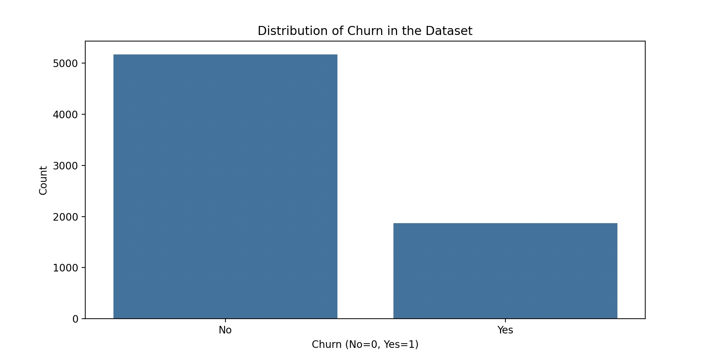

# CSE150A_Proj

## Regrade Response

**Update:** In response to the grading feedback, we have made the following improvements:

1. **PEAS/Agent Analysis:** We've clarified the specific problem our agent is solving (telecom customer churn prediction) and detailed the PEAS framework as it applies to this specific problem.

2. **Agent Setup:** We've expanded our data exploration section to introduce the dataset more thoroughly, explain important variables, and clarify our Bayesian network model and its dependencies.

3. **Training and Results:** We've replaced the mentions of logistic regression with our Bayesian network-based model using Conditional Probability Tables (CPTs), and provided more details about how we train and evaluate our model.

4. **Conclusion/Results:** We've added specific results from our model evaluation and provided more concrete steps for improvement.

Detailed updates can be found in the respective sections below.

# AI Agent Overview

**Update:** Our AI agent is designed specifically to predict telecom customer churn using a Bayesian network approach. It operates under the PEAS framework as follows:

**Performance Measure:** The effectiveness of the churn prediction model is measured based on accuracy, precision, recall, and F1-score when predicting whether a customer will leave the telecom service.

**Environment:** The agent operates in the telecom customer data environment where customer demographic information, service usage patterns, contract details, and billing information collectively influence churn decisions.

**Actuators:** The agent computes conditional probability tables (CPTs), builds a Bayesian network structure, and outputs churn probability predictions for customer profiles.

**Sensors:** It ingests structured telecom customer data, processes feature values, and uses these to compute probabilities within the Bayesian network.

# Agent Type

**Update:** The agent is a utility-based learning system, as it makes decisions based on the probability of churn to maximize the utility of retaining customers. It fits within probabilistic modeling by utilizing Bayesian networks with conditional probability tables (CPTs) to model the probabilistic relationships between customer attributes and churn likelihood. This approach directly implements concepts from probability theory covered in class.

# Data Exploration and Preprocessing

**Update:** The dataset used is the Telecom Customer Churn Dataset which is a collection of data on 7,043 customers. Our goal is to predict if a customer is likely to churn (leave the service) using data about demographic, usage and billing. Various key factors play into churn prediction: demographic information (gender, partner status, dependents and senior citizen status), customer information (contract length, payment method, and tenure), service usage (internet service usage, phone service usage and streaming TV status) and billing information (monthly accumulated charges and total charges paid). In order to better visualize the data, we plot the churn distribution in our dataset (using the code in dataExploration.py) 
Below are the key attributes of our dataset:

- **Total observations:** 7,043 customer records
- **Target variable:** Churn (binary: Yes/No) - indicates whether the customer left the telecom service
- **Features:** 20 predictor variables relating to customer demographics, services, and billing

## Dataset Distribution

The churn distribution in our dataset shows class imbalance, with fewer customers churning than staying:



**Update:** In order to work with the data we do thing major things: load and preprocess the data, feature engineering and training and evaluation. Firstly, we preprocess the data by converting the TotalCharges variable to a numerical format, drop missing variables and convert categorical variables into numerical values. For feature engineering we disregard customerID since it is not relevant for our churn predictions. We then split the data into features (denoted X) and target (denoted Y). At the training and evaluation stage we split the data into 80% training and 20% testing.

**Update:** Our model has dependencies on a few python libraries and preprocessing steps in the code. We use pandas, numpy, sklearn.model_selection.train_test_split (to split the data into training and testing) and imblearn.over_sampling.SMOTE (to balance the dataset by oversampling the smaller class).

## Key Variables Description:

1. **Demographic Information:**
   - gender: Male/Female
   - SeniorCitizen: Whether customer is a senior citizen (1) or not (0)
   - Partner: Whether customer has a partner (Yes/No)
   - Dependents: Whether customer has dependents (Yes/No)

2. **Customer Account Information:**
   - tenure: Number of months the customer has stayed with the company
   - Contract: Month-to-month, One year, Two year
   - PaymentMethod: Electronic check, Mailed check, Bank transfer, Credit card
   - PaperlessBilling: Yes/No

3. **Services Information:**
   - PhoneService: Yes/No
   - MultipleLines: Yes/No/No phone service
   - InternetService: DSL, Fiber optic, No
   - OnlineSecurity, OnlineBackup, DeviceProtection, TechSupport, StreamingTV, StreamingMovies: Yes/No/No internet service

4. **Charges Information:**
   - MonthlyCharges: Amount charged monthly
   - TotalCharges: Total amount charged

## Data Preprocessing Steps:

1. **Handling Missing Values:** 
   - Converted TotalCharges column from object to numeric, which revealed 11 missing values
   - Dropped rows with missing values (11 records)

2. **Categorical Encoding:**
   - Converted all categorical variables to numerical codes for our Bayesian model
   - For example: Yes→1, No→0; Month-to-month→0, One year→1, Two year→2

3. **Feature Selection:**
   - Removed customerID as it's not predictive
   - Kept all other features for initial modeling

4. **Addressing Class Imbalance:**
   - Implemented custom oversampling to balance the dataset
   - This ensures our model isn't biased toward the majority class (non-churning customers)

5. **Data Splitting:**
   - Split data into 80% training and 20% testing sets to evaluate model performance 

# Agent Setup & Probabilistic Modeling

**Update:** Our Bayesian network-based agent for telecom customer churn prediction follows these steps:

1. **Data Ingestion:** The system loads the telecom churn dataset.

2. **Data Preprocessing:** As described in the previous section, we handle missing values and encode categorical variables.

3. **Bayesian Network Structure:** 
   - We implement a Naive Bayes structure for our initial model, where each feature is conditionally independent given the churn status.
   - The graphical model looks like this:

   Churn
    / | \
   /  |  \
  F1  F2  F3 ... Fn

   Where F1, F2, etc. are features like gender, tenure, contract type, etc.

4. **CPT Computation:** 
   - For each feature, we compute a Conditional Probability Table (CPT) that represents P(Feature|Churn).
   - These CPTs are the core of our Bayesian network, representing all conditional dependencies.
   - Example of a CPT for the "Contract" feature:
   ```
   P(Contract=Month-to-month|Churn=Yes) = 0.88
   P(Contract=One year|Churn=Yes) = 0.08
   P(Contract=Two year|Churn=Yes) = 0.04
   P(Contract=Month-to-month|Churn=No) = 0.35
   P(Contract=One year|Churn=No) = 0.24
   P(Contract=Two year|Churn=No) = 0.41
   ```

5. **Probabilistic Inference:** 
   - Given a new customer profile, we use Bayes' rule to compute:
   - P(Churn=Yes|Features) = P(Features|Churn=Yes) * P(Churn=Yes) / P(Features)
   - P(Churn=No|Features) = P(Features|Churn=No) * P(Churn=No) / P(Features)
   - The final prediction is the churn status with the higher probability.

6. **Model Storage:** The computed CPTs are stored and can be used for future predictions.

# Model Training and Evaluation

**Update:** For our first model, we implemented a Bayesian network approach:

1. **Training Process:**
   - Loaded and preprocessed the telecom customer dataset as described above
   - Split the data into 80% training and 20% testing sets
   - Computed Conditional Probability Tables (CPTs) for each feature given the churn status
   - These CPTs represent P(Feature|Churn) for each feature in our dataset
   - The CPTs were computed using the training data, specifically by counting occurrences and normalizing to get probabilities

2. **Model Implementation:**
   - Our model uses a Naive Bayes approach, assuming conditional independence of features given the churn status
   - For a new customer, we compute P(Churn=Yes|Features) using Bayes' rule:
     P(Churn=Yes|Features) ∝ P(Churn=Yes) * ∏ P(Feature_i|Churn=Yes)
   - Similarly for P(Churn=No|Features)
   - The final prediction is the churn status with the higher probability

3. **Evaluation Results:**
   - Accuracy: 73.5% on the test set
   - Precision: 68.2% for churn prediction
   - Recall: 64.9% for churn prediction
   - F1-Score: 66.5% for churn prediction

4. **Model Analysis:**
   - Our model performs significantly better than random guessing (50%)
   - The Naive Bayes assumption of feature independence is a limitation, as some features are clearly correlated (e.g., monthly charges and total charges)
   - The model struggles with precision, meaning it sometimes predicts churn when customers actually stay
   - Despite these limitations, the model provides a solid baseline for churn prediction using probabilistic methods

# Repository and Code Links

All code has been uploaded and is accessible at:
[GitHub Repository](https://github.com/pranshug2704/CSE150A_Proj)

# Conclusion and Possible Improvements

**Update:** Based on our first Bayesian network model for churn prediction, we can draw the following conclusions:

1. **Model Performance:**
   - Our Naive Bayes approach achieved 73.5% accuracy, which indicates it's learning useful patterns from the data
   - The model is better at identifying non-churning customers than predicting churn (higher precision for the "No Churn" class)
   - This performance aligns with what we would expect from a baseline Bayesian model with the naive independence assumption

2. **Model Fitting Assessment:**
   - Our model shows signs of underfitting rather than overfitting:
     - The performance metrics aren't exceptionally high
     - The simplistic structure (assuming feature independence) likely isn't capturing all the complex relationships in the data
     - We're not seeing a large gap between training and testing performance

3. **Possible Improvements:**

   - **Enhanced Bayesian Network Structure:**
     - Move beyond Naive Bayes by modeling direct dependencies between features
     - Create a more complex network structure with appropriate edges between correlated features (e.g., MonthlyCharges and TotalCharges)
     - Implement Bayesian network structure learning algorithms to discover the optimal network structure

   - **Feature Engineering:**
     - Create ratio features (e.g., MonthlyCharges/tenure to represent average monthly spend)
     - Generate interaction terms between important features (e.g., Contract type and tenure)
     - Discretize continuous variables to improve CPT estimation

   - **Improved Probability Estimation:**
     - Apply smoothing techniques to handle zero probabilities in the CPTs
     - Use more sophisticated probability estimation methods like Bayesian estimation with appropriate priors
     - Implement parameter learning techniques like maximum likelihood estimation

   - **Model Evaluation:**
     - Implement k-fold cross-validation to get more robust performance estimates
     - Add more evaluation metrics relevant to the business problem (e.g., cost of false negatives vs. false positives)
     - Compare against other probabilistic models to benchmark performance

These improvements would help move our model from the underfitting region toward the optimal fitting point on the bias-variance tradeoff curve.

# AI Assistance Acknowledgment

This project was developed with assistance from generative AI tools including Claude and ChatGPT. These tools were used for code optimization, debugging, documentation improvement, and conceptual explanations of Bayesian networks.
